**Stormy full schematic** (KiCad 10.0, 2026-08-12)

<table>
<tr>
<td width="50%">

Stormy logo created by LogoDesignGen
</td>
<td width="50%">
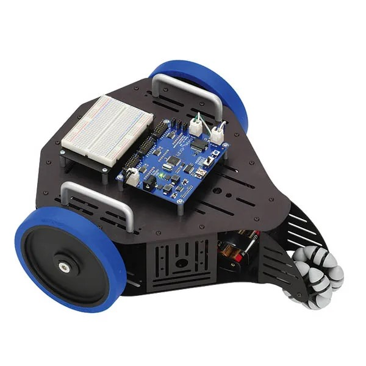
Original Parallax Stingray robot, no longer in production
</td>
</tr>
</table>

Recreating Stingray top/bottom plates in 1/4" acrylic

**Assembled Stormy the Stingray robot**

<table>
<tr>
<td width="50%">

</td>
<td width="50%">

</td>
</tr>
<tr>
<td width="50%">

</td>
<td width="50%">

</td>
</tr>
<tr>
<td width="50%">

</td>
<td width="50%">

</td>
</tr>
</table>

## Documentation

Full build and rebuild procedures for Stormy - subsystem chapters,
wiring, RoboClaw configuration, ROS 2 setup, Nav2 / SLAM tuning, and
diagnostics - live in a separate companion repository:

- **[stingray-builders-manual](https://github.com/JHPHELAN/stingray-builders-manual)**
  (private) - contains the Builder's Manual (22 chapters + 7
  appendices, plain text), the Field Notes (103 numbered
  field-tested lessons), and the Curation Notes (stardated
  distillate of the source log).

This `README` is the hardware **photo + sourcing catalog** - "what does
it look like and where do I buy it".  The Manual is the build guide -
"how do I put it together, configure it, and rebuild it after
disaster".

**Software** (ROS 2 drivers, launch files, URDF, Nav2 params) lives in
a separate repo:

- https://github.com/JHPHELAN/articubot_one - branch `exploration` is
  the current work.

---

## HARDWARE

> [!WARNING]
> **Two Parallax originals no longer available**
>
> ---
>
> **1. Rear caster**
>
> The original Parallax omni-wheel rear caster and its bracket are
> both out of production and there is no drop-in substitute today.
> If you intend to build this robot, you will have to solve the rear-
> caster problem yourself: source or 3D-print a small omni-wheel and
> design a bracket that holds it at the correct height to keep the
> chassis level with the drive wheels.
>
> Closest similar omni on Amazon as of 2026-08 is
> [B0DDVJS42J](https://www.amazon.com/dp/B0DDVJS42J), but it will
> require a custom bracket.
>
> 
>
> **Alternative under consideration — Pololu 3/4" metal ball caster**
>
> Mounted directly under the rear bottom plate.  Load rating ~10 lb
> (well within Stormy's measured 0.549 kg / 1.21 lb rear-caster load;
> total robot mass 3.269 kg).  Height 0.83" would tip the nose down;
> two candidate compensations:
>
> 1. **Rotate each drive motor 180°** so the asymmetric shaft sits at
>    the lower position, dropping the wheel ~1 cm, and lower the side-
>    plate motor hole to match.  With the existing ~1 cm clearance
>    below the motors that gives ~2 cm of adjustment to work with.
> 2. **Acrylic riser mount** — a short piece of laser-cut 1/4" acrylic
>    rounded to complement the caster, with spacers as needed, placed
>    on top of the lower plate to raise the ball caster to the correct
>    height without touching the drive wheels.
>
> 
>
> [Product Link (Robotshop)](https://www.robotshop.com/products/pololu-ball-caster-3-4-in-metal-ball)
>
> Reference material for the bracket design:
>
> Original Parallax exploded diagram:
>
> 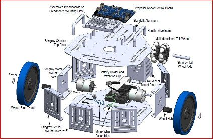
>
> Current Stormy bottom view:
>
> 
>
> Current bracket, measured with ruler:
>
> 
> 
> 
>
> ---
>
> **2. Motor / wheel side support brackets**
>
> The two side brackets that hold the drive-motor / wheel assemblies
> are also Parallax originals and out of production.  They are NOT
> reproducible in 1/4" cast acrylic - the tolerances are too tight -
> so they must be fabricated in sheet metal.  The originals have
> captive nuts pressed into the flap, which is very convenient;
> replacements with plain bolt-and-nut hardware work but are less
> handy.  A local maker space with a sheet-metal brake can probably
> make these to order.
>
> Dimensions (measured off the originals):
> - Side panel: 3" wide x 3" high, center-drilled for the 1/4"
>   motor output shaft.
> - Top and bottom right-angle flaps: 5/8" wide.
> - Inset captive nuts: 1 3/4" apart, 3/8" from the outer edge.
>
> *TODO: add photo of an original bracket + a dimensioned drawing.*

### Structural stock

Top plate, side plates, and bottom plate are all laser-cut from 1/4"
cast acrylic sheet.  One 12" x 12" sheet is enough for a full set.

<table>
<tr>
<td width="33%" align="center">

 
<b>Novabright clear cast acrylic, 1/4" x 12" x 12"</b>
 
<a href="https://www.amazon.com/dp/B0GSVXQC45">Product Link</a>
</td>
</tr>
</table>

CorelDRAW 2018 CAD drawings for laser cutting:

<table>
<tr>
<td width="33%" align="center">

 
<a href="images/Stingray%20Bottom%20Plate.cdr">Bottom plate (.cdr)</a>
</td>
<td width="33%" align="center">

 
<a href="images/Stingray%20Top%20Plate.cdr">Top plate (.cdr)</a>
</td>
<td width="33%" align="center">

 
<a href="images/Stingray%20Side%20Panel%20Blank.cdr">Side panel (.cdr)</a>
 
<i>Blank example showing the fuse-holder hole</i>
</td>
</tr>
</table>

<table>
<tr>
<td width="33%" align="center">

 
2 motors: Pololu 50:1 37Dx70L mm 12V 64 CPR Encoder 6mm D output shaft
 
50 x 64 = 3200 counts / revolution
 
<a href="https://www.pololu.com/product/4753">Product Link</a>
</td>
<td width="33%" align="center">

 
2 BaneBots 4 7/8" T81 hex hub wheels (no longer available from Parallax)
 
<a href="https://banebots.com/banebots-wheel-4-7-8-x-0-8-hub-mount-50a-blue/">Product Link</a>
</td>
<td width="33%" align="center">

 
6mm D to 12mm Hex snap ring hub adapter. 3D CAD file on source web site.
 
<a href="https://banebots.com/t81-hub-6mm-shaft/">Product Link</a>
</td>
</tr>
</table>

**Wheel Specifications:**

4 7/8" dia = 0.123825m dia

wheel radius = 0.123825m dia / 2 = 0.0619125 = 0.062m

wheel circumference = 0.123825m dia x Pi = 0.3890m circ = m/rev

confirmed by tape measurement of circumference

revolutions / meter = 1m / 0.39 m/R = 2.57 R/m

counts / meter = 2.57 R/m x 3200 C/R = 8226 C/m

## CPU

<table>
<tr>
<td width="50%" align="center">

 
<b>GeeekPi PD Power Expansion Board</b>
 
<a href="https://52pi.com/collections/raspberry-pi-1/products/52pi-pd-power-extension-adapter-board-for-raspberry-pi-5">Product Link</a>
</td>
<td width="50%" align="center">

 
<b>Raspberry Pi 5 8GB</b>
 
<a href="https://www.raspberrypi.com/products/raspberry-pi-5/">Product Link</a>
</td>
</tr>
<tr>
<td width="50%" align="center">

 
<b>PCIe Hat</b>
 
<a href="https://www.amazon.com/dp/B0CPPGGDQT">Product Link</a>
</td>
<td width="50%" align="center">

 
<b>PCIe Memory</b>
 
<a href="https://www.amazon.com/dp/B0C5D6C1YQ">Product Link</a>
</td>
</tr>
</table>

## Power

<table>
<tr>
<td width="33%" align="center">
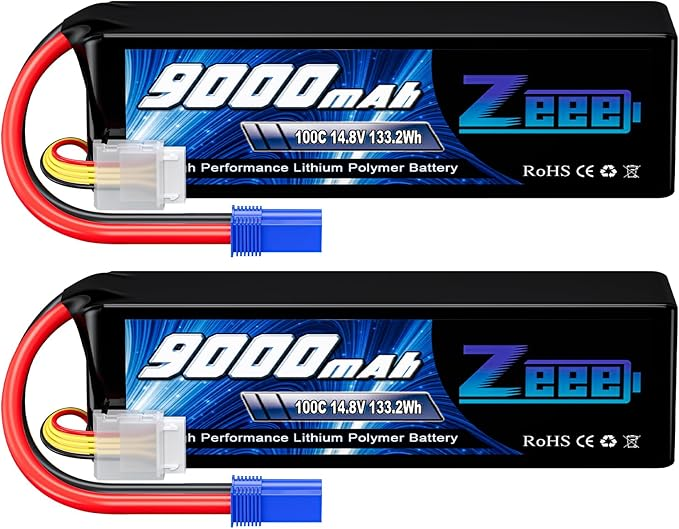
 
<b>LiPo 14.8V 9000mAh 100C Zeee battery</b>
 
<a href="https://www.amazon.com/dp/B09NKCKWV3">Product Link</a>
</td>
<td width="33%" align="center">

 
<b>LiPo battery low voltage 'screamer'</b>
 
<a href="https://www.amazon.com/dp/B08YY5ZL93">Product Link</a>
</td>
<td width="33%" align="center">

 
<b>Emergency stop button</b>
 
<i>Breaks the LiPo &rarr; bus. See Manual &sect;3.2.</i>
 
<a href="https://www.amazon.com/dp/B07BCY7HGN">Product Link</a>
</td>
</tr>
<tr>
<td width="33%" align="center">
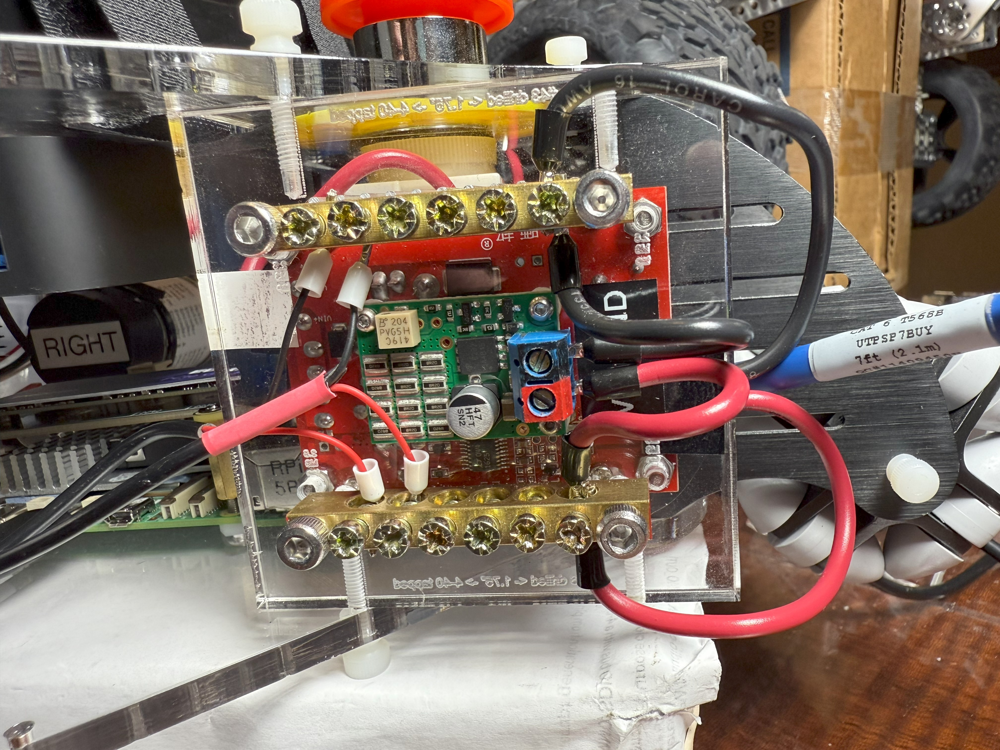
 
<b>12V power bus</b>
 
<a href="https://www.amazon.com/dp/B097R5J66D">Product Link (bus bar)</a>
 

</td>
<td width="33%" align="center">

 
<b>Shunt Regulator</b>
 
<a href="https://www.pololu.com/product/3779">Product Link</a>
</td>
<td width="33%" align="center">
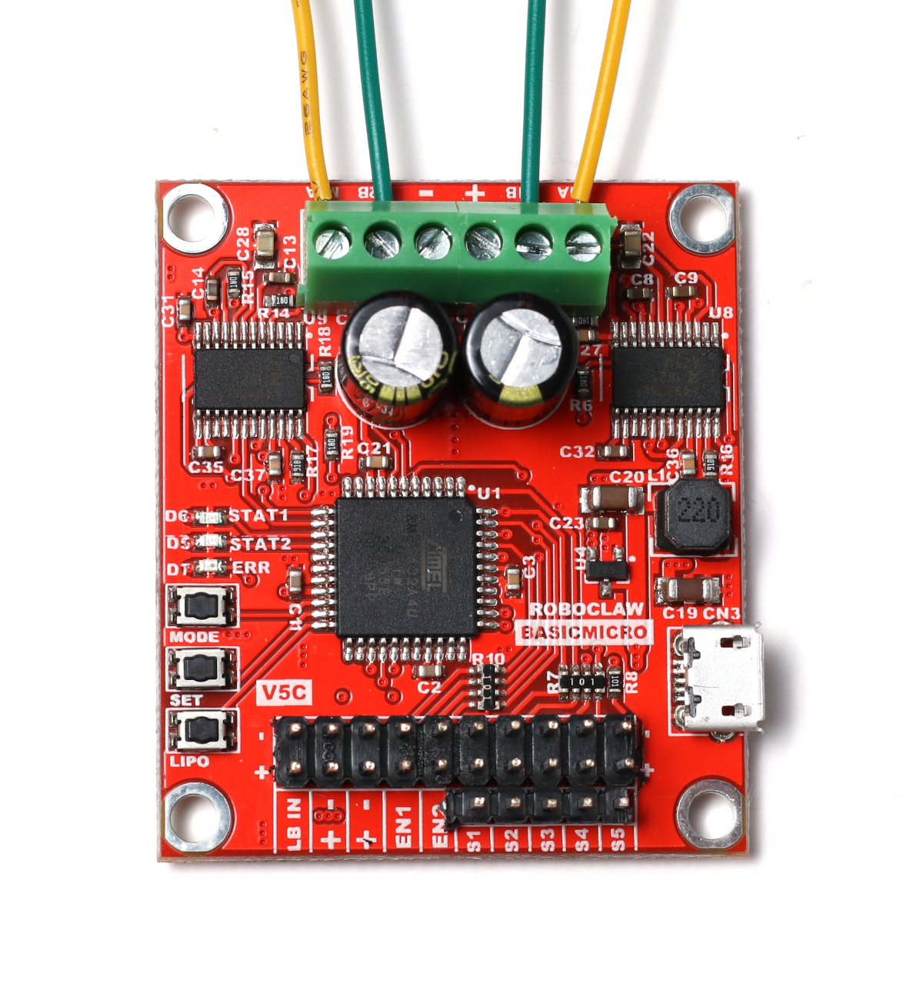
 
<b>Roboclaw 2x7A</b>
 
<a href="https://www.basicmicro.com/Roboclaw-2x7A-Motor-Controller_p_55.html">Product Link</a>
</td>
</tr>
<tr>
<td width="33%" align="center">
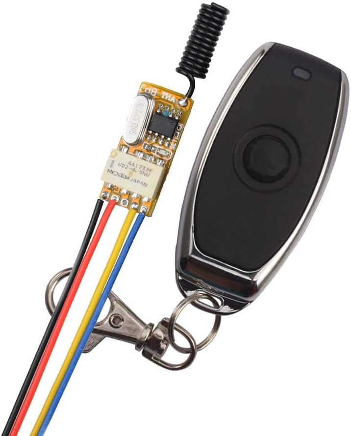
 
<b>Remote kill switch</b>
 
<i>Kills RoboClaw power to motors only. Bus remains live. See Manual &sect;3.2.</i>
 
<a href="https://www.amazon.com/dp/B08D39XWS5">Product Link</a>
</td>
<td width="33%" align="center">

 
<b>Slide switch DPDT to control headlights and RoboClaw reset</b>
 
<a href="https://www.amazon.com/dp/B09V77VCF7">Product Link</a>
</td>
<td width="33%" align="center"></td>
</tr>
</table>

### Bus protection

<table>
<tr>
<td width="33%" align="center">

 
<b>15 A slow-blow 5x20 mm ceramic fuse</b>
 
<a href="https://www.amazon.com/dp/B0CRVLV5LY">Product Link</a>
</td>
<td width="33%" align="center">

 
<b>Panel-mount fuse holder, 5x20 mm</b>
 
<a href="https://www.jameco.com/webapp/wcs/stores/servlet/ProductDisplay?storeId=10001&langId=-1&catalogId=10001&pa=18703&productId=18703">Product Link (Jameco 18703)</a>
</td>
<td width="33%" align="center">

 
<b>Schottky diode STPS10L25D</b>
 
<i>Across the fuse - handles the fuse-blown case when the shunt loses bus reference.  See Manual &sect;3.1.</i>
 
<a href="https://www.digikey.com/en/products/detail/STPS10L25D/497-2738-5-ND/603763">Product Link (DigiKey)</a>
</td>
</tr>
</table>

 
<i>Bus-protection protoboard - fuse holder, Schottky, and bus taps on a single board for improved connections.</i>

### Battery maintenance

<table>
<tr>
<td width="33%" align="center">

 
<b>LiPo balance charger / discharger</b>
 
<a href="https://www.amazon.com/dp/B0GSKJYK1B">Product Link</a>
</td>
</tr>
</table>

**FHL-LD19 LIDAR** - replaced the belt-driven YDLIDAR X2.  See Manual
Chapter 7 for the udev symlink rule, the ldlidar_ros2 driver build fix
(pthread include), and the SLAM Toolbox tuning that goes with it.

Amazon: https://www.amazon.com/dp/B0B1QCV4XR

Youyeetoo direct: https://www.youyeetoo.com

## IMU

Adafruit BNO085 breakout, mounted at base_link, wired to the Pi's
I2C bus 1 at address 0x4A.  Uses game-rotation-vector mode
(magnetometer disabled) for indoor stability.  See Manual Chapter 6
for the driver, EKF integration, and verification recipes.

<table>
<tr>
<td width="33%" align="center">

 
<b>BNO085 STEMMA QT breakout</b>
 
<a href="https://www.adafruit.com/product/4754">Product Link (Adafruit)</a>
</td>
<td width="33%" align="center">

 
<b>Wiring</b>
 
<i>Pi pin 3 SDA (blue), pin 5 SCL (yellow), pin 4 3V3 (red), pin 6 GND (black).  If i2cdetect shows nothing, try swapping SDA / SCL - some breakouts' silk-screens are reversed.</i>
</td>
<td width="33%" align="center">

 
<b>IMU mount</b>
 
<i>1/4" cast acrylic sheet, laser-cut to size with markers and text laser-etched, edges drill-pressed and hand-tapped.  Front (+x) edge of the breakout attached with M2.5 nylon screws.  Mount fastened to the bottom plate with nylon thumbscrews to place the IMU at base_link.</i>
</td>
</tr>
</table>

## Camera

Currently installed on Stormy: **OAK-D**.  The fisheye and Intel
RealSense D455 shown below are historical alternates evaluated during
development and left in this README for reference.

<table>
<tr>
<td width="33%" align="center">
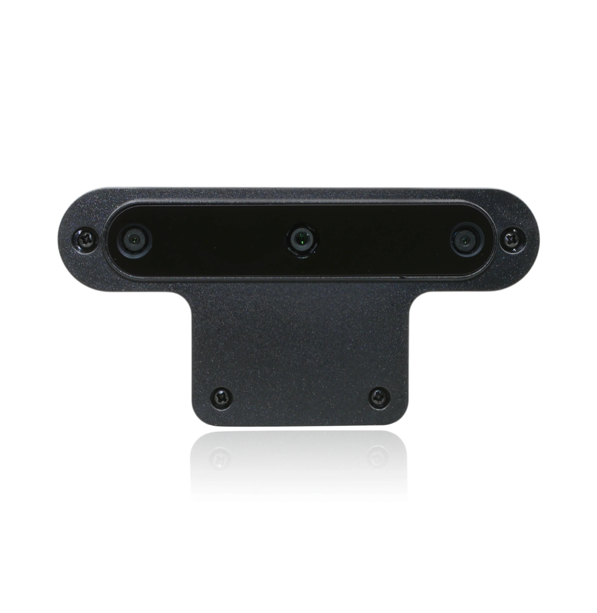
 
OAK-D (currently installed)
 
<a href="https://shop.luxonis.com/products/oak-d">Product Link</a>
</td>
<td width="33%" align="center">

 
Fisheye camera (historical alternate)
 
<a href="https://www.spinelelectronics.com/product/uc50mpb/">Product Link</a>
</td>
<td width="33%" align="center">
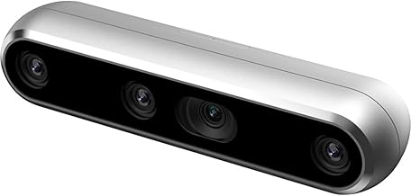
 
Intel RealSense 455 (historical alternate)
 
<a href="https://www.amazon.com/dp/B08KJCRCGG">Product Link</a>
</td>
</tr>
</table>

## Indicators

Headlights, amber-LED beacon, and USB-audio speaker for WAV alerts,
all driven from Pi GPIO through a custom PCB.  See Manual Chapter 16
for the ROS 2 node behaviour, joystick button mapping, and Nav2
alert logic.

### Parts

<table>
<tr>
<td width="50%" align="center">

 
<b>Sabrent USB audio DAC</b>
 
<a href="https://www.amazon.com/dp/B00IRVQ0F8">Product Link</a>
</td>
<td width="50%" align="center">

 
<b>Mini 8-ohm speaker (4-pack)</b>
 
<a href="https://www.amazon.com/dp/B0B4D1BN4F">Product Link</a>
</td>
</tr>
<tr>
<td width="50%" align="center">

 
<b>Headlights</b>
 
<i>Eagle-Eye style, 9W 12V, 12mm - sold in 10-packs.  Two used on Stormy.</i>
 
<a href="https://www.amazon.com/dp/B06ZYKWQZC">Product Link</a>
</td>
<td width="50%" align="center">

 
<b>CHANZON multicolor 5&nbsp;mm LED assortment</b>
 
<a href="https://www.amazon.com/dp/B08G4XCQSW">Product Link</a>
</td>
</tr>
</table>

*TODO: add remaining indicators BoM items with photos and links:
IRLZ44N MOSFET (Amazon B0CBKH4XGL), and the custom JLCPCB PCB
fabrication.*

### Design journey

The current PCB is Rev 3 - two IRLZ44N logic-level MOSFETs driven
directly from Pi GPIO, no NPN inverter stage.  Two earlier revisions
and a Flux.ai adventure preceded it.

**Original schematic** (before the piezo beeper was dropped).  Both
amber-LED lines are on the same GPIO circuit; the second line is
unused on the current PCB.

**Unsuccessful protoboard attempt.**

**Flux.ai PCB layout.**

**Completed PCB** (JLCPCB).

**Populated PCB installed inside the upper plate** (view from below).

**Indicators in action:** headlights on, amber LEDs illuminated,
speaker between the LiDAR supports (later moved to the rear caster
bracket).

**Lesson learned.**  I spent way too much time and money nudging
Flux.ai as it obsessed and dithered over a simple circuit.  Would
have been better off designing by hand or with one of the free online
tools from the PCB makers (EasyEDA at JLCPCB, KiCad).  A second
protoboard attempt would likely have succeeded.

## Networking

<table>
<tr>
<td width="50%" align="center">

 
<b>USB WiFi dongle - Realtek RTL8812BU with 5 dBi antenna</b>
 
<i>Stormy uses this dongle in preference to the Pi 5's internal wlan0, which is broken by design at 2.4 GHz.  See Manual Chapter 9.</i>
 
<a href="https://www.amazon.com/dp/B078NSSM7W">Product Link</a>
</td>
<td width="50%" align="center">

 
<b>Powered USB 3.0 hub, 4-port (Acer)</b>
 
<i>Feeds the USB WiFi dongle, LD19 LiDAR, USB audio DAC, and drydock keyboard/mouse.  Power-capable but currently running bus-powered from the Pi; powering it from the LiPo bus is an open question.  See Manual &sect;3.1.</i>
 
<a href="https://www.amazon.com/dp/B0CPSSD43L">Product Link</a>
</td>
</tr>
</table>

## Accessories and tools

_A running list of the smaller parts and the tools that shape them.
Everything here is used in the current build; sources and photos are
being filled in over time._

### Connectors

- **PowerPole housings + contacts** (Anderson Powerpole, sold by
  Powerwerx) - main bus, battery, and subsystem connections
  throughout the robot.
   <a href="https://powerwerx.com/150-piece-anderson-powerpole-connector-case">Product Link (150-piece assortment case)</a>
   
- **PowerPole crimper** (Powerwerx TriCrimp - MUST BUY, no
  substitutes).
   <a href="https://powerwerx.com/tricrimp-powerpole-connector-crimping-tool">Product Link (TriCrimp)</a>
   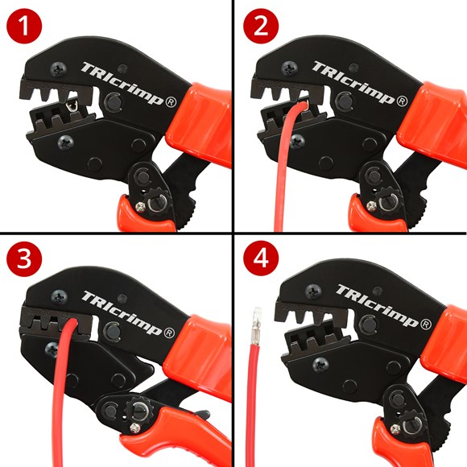
- **PowerPole insertion / removal / extraction tool** - very useful
  for reworking existing bundles without cutting them apart.
   <a href="https://powerwerx.com/powerpole-insertion-removal-extraction-tool">Product Link</a>
   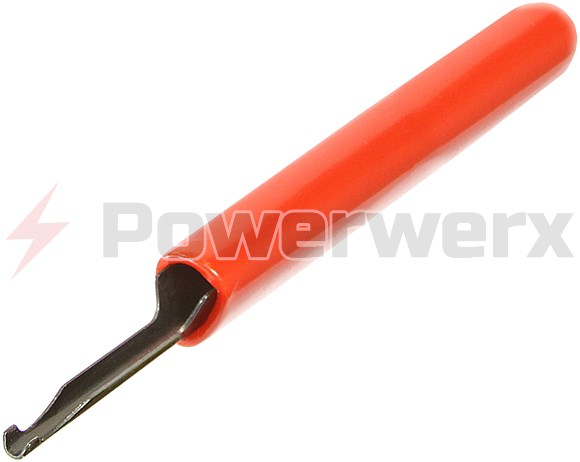
- **LiPo battery connectors, EC5 male / female** - battery-side
  plug pair.  The Zeee LiPo ships with EC5 pigtails; a matching pair
  on the bus side lets the battery come off cleanly for balance
  charging.
   <a href="https://www.amazon.com/dp/B08M3WND19">Product Link</a>
   
- **Ferrule crimper + assorted-color ferrule kit** -
  <a href="https://www.amazon.com/dp/B0G1TSPZ93">Product Link</a>
   
- **DuPont jumper connectors + crimper** (0.1" pitch) - GPIO
  connections to RoboClaw, BNO085 IMU, Indicators PCB.
   <a href="https://www.amazon.com/dp/B0B11RLGDZ">Product Link (Taiss ratcheting crimper + connector kit)</a>
   
- **Spade connectors, 22-10 AWG assortment + crimper** - fuse
  holder, DPDT switch, and legacy pigtails.
   <a href="https://www.amazon.com/dp/B0CNRP9MT6">Product Link (Twidec insulated spade assortment)</a>
   
- **DC power plugs** - inline barrel plug pigtails for:
    - the LiPo bus &rarr; 52Pi PD board 12-24V input
    - 52Pi 5V output &rarr; OAK-D aux power feed
   <a href="https://www.amazon.com/dp/B01G6EB99E">Product Link</a>
   

### Wire

- **Silicone parallel wire, assorted gauges** - multiple sizes used
  across the build.
   
   Representative sources (2-conductor silicone parallel):
   <a href="https://www.amazon.com/dp/B07RSRBZZD">14 AWG</a>
   <a href="https://www.amazon.com/dp/B07FMLVF84">16 AWG</a>
   <a href="https://www.amazon.com/dp/B07RVMHSK4">18 AWG</a>
   <a href="https://www.amazon.com/dp/B07K9JKXM9">20 AWG</a>

### Fasteners

- **M2.5 x 18mm + 6mm brass hex standoffs, male-female** - stack the
  52Pi PD power extension board above the Pi 5.  Use included shorter
  standoffs for clearance for the PCIe HAT below.
   <a href="https://www.amazon.com/dp/B0FP2QGTD4">Product Link</a>
   
- **Nylon standoffs, 1.5" x 1/4" round, female-female, 4-40** -
  LiDAR triangle mount on the top plate (see Manual Chapter 7.1).
   <a href="https://www.mcmaster.com/products/nylon-spacers/standoffs-2~/standoffs-2~shape~hex/thread-size~4-40/length~1-500/length~1-1-2/?s=nylon-spacers">Product Link (McMaster-Carr)</a>
   
- **Nylon thumbscrews** - tool-free access panels.
   <a href="https://www.digikey.com/en/products/detail/essentra-components/090440037T/10243363">Product Link (DigiKey / Essentra 090440037T)</a>
   
- **Drill bits and taps, assorted metric and imperial** - for the
  top plate LiDAR mounts, indicator PCB mounting, and any hole that
  needs threads.  Stormy uses both metric (M2.5, M3) and SAE (4-40)
  threads, so you need both tap families on the bench.
   <a href="https://www.amazon.com/dp/B0CX87WR49">uxcell titanium tapping / threading kit (metric)</a>
   <a href="https://www.amazon.com/dp/B0G845TP6Y">Century Drill &amp; Tool 13-piece tap set</a>
   <a href="https://www.lowes.com/pd/IRWIN-All-Purpose-SAE-13-Pack-Tap-and-Drill-Set/1003019164">IRWIN Hanson 13-pack SAE tap &amp; drill set (Lowes)</a>
   
  <table>
  <tr>
  <td width="50%" align="center">
  
   Metric taps
  </td>
  <td width="50%" align="center">
  
   SAE taps &amp; drill bits
  </td>
  </tr>
  </table>
- **Snap-ring pliers** - the drive wheels are retained on the T81
  hex hub adapters by snap rings.  Without proper pliers this is
  nearly impossible and outright dangerous - a slipping snap ring
  can fly at high speed.  **Wear safety glasses.**  This inexpensive
  set is adequate.
   <a href="https://www.amazon.com/dp/B09LVCV93Q">Product Link</a>
   

### Mounting adhesives and straps

- **Foam tape** - mounts the fuse-holder proto-board to the rear side
  panel; general-purpose vibration-damped mounting.
   <a href="https://www.amazon.com/dp/B007Y7ITMS">Product Link</a>
   
- **Velcro straps** - battery hold-down and cable management.
   <a href="https://www.amazon.com/dp/B071DGMNMX">Product Link</a>
   
- **Velcro fasteners** (adhesive-back hook-and-loop mounting squares)
  - reversible mounting for mini speaker, LIDAR USB adapter, LiPo
  screamer.
   <a href="https://www.amazon.com/dp/B09S163TNK">Product Link</a>
   

### Labeling

- **Heat-shrink tubing, assorted sizes** - insulation, strain
  relief, polarity, or identification on connections.
   <a href="https://www.amazon.com/dp/B00VDVT7IG">Product Link (Swordfish 61190 assorted-color heat-shrink kit)</a>
   
- **Heat gun** (with reflector nozzle) - shrinks the tubing above and
  the DYMO label tubing below.  The reflector nozzle protects nearby
  wires from the direct blast.
   <a href="https://www.amazon.com/dp/B08VFY8THD">Product Link (SEEKONE 350W mini, 2 temp settings)</a>
   
- **Heat-shrink label maker + label tubing** - wire and connector
  identification.  Compatible heat-shrink label tubing is available
  through the DYMO ecosystem linked below.
   <a href="https://www.amazon.com/dp/B005MR516Y">DYMO Industrial label maker</a>
   

_*TODO*: add anything else that belongs on this list - if you buy it,
reach for it, or crimp with it while working on Stormy, add it here._

---

## Bill of materials

Rough cost to buy every part and tool listed above from scratch, as
of **2026-08-02**: **approximately $1,890.**

### Split by type

The CSV is organized into three sections via the `Type` column, so a
reader can tell at a glance what fraction of the cost is one-time
tooling vs. actual parts on the robot:

| Type | Items | Subtotal | What it is |
|---|---:|---:|---|
| **Components** | 29 | $1,265.31 | Actual parts installed on Stormy - one of each per robot |
| **Supplies** | 17 | $256.69 | Consumables: raw acrylic stock, wire, connector assortments, fastener packs, tape, heat-shrink |
| **Tools** | 12 | $368.45 | One-time bench purchases: crimpers, tap sets, snap-ring pliers, heat gun, DYMO, LiPo balance charger |
| **Grand total** | 58 | **$1,890.45** | |

### Split by subsystem

Individual line items, unit prices, and quantities live in the
companion worksheet [`BOM_pricing_worksheet.csv`](BOM_pricing_worksheet.csv)
in this repo (sorted with Components first, Supplies second, Tools
last) - restart from that file when you reprice, and update this
table to match.

| Subsystem | Subtotal |
|---|---:|
| Structural (acrylic sheet stock) | $48.99 |
| Rear caster (aspirational - see WARNING) | $12.21 |
| Drivetrain (motors, wheels, hubs) | $140.90 |
| CPU (Pi 5, 52Pi, PCIe HAT, SSD) | $261.82 |
| Power (LiPo, e-stop, RoboClaw, shunt, indicators front-end) | $305.33 |
| Bus protection (fuse, fuse holder, Schottky) | $10.40 |
| Battery maintenance (balance charger) | $31.99 |
| LIDAR (LD19) | $71.90 |
| IMU (BNO085 breakout) | $24.95 |
| Camera (OAK-D only; historical alternates excluded) | $329.00 |
| Indicators (DAC, speaker, MOSFETs, LEDs, PCB) | $96.81 |
| Networking (USB WiFi dongle, powered USB hub) | $34.97 |
| Connectors (PowerPole, EC5, DuPont, spade, ferrule, DC plugs, tools) | $169.92 |
| Wire (14/16/18/20 AWG silicone) | $70.82 |
| Fasteners (standoffs, thumbscrews, tap/drill kits, snap-ring pliers) | $102.56 |
| Mounting (foam tape, Velcro straps, Velcro squares) | $20.60 |
| Labeling (heat-shrink, heat gun, DYMO label maker) | $157.28 |
| **Grand total (from `BOM_pricing_worksheet.csv`)** | **$1,890.45** |

Caveats:

- **Pack-size accounting.**  Prices reflect the full pack you have
  to buy even when Stormy only uses a fraction of it - the
  headlights are a 10-pack, the DPDT switches a 20-pack, and so on.
  If you build a second robot, most consumable subtotals go to zero.
- **Alternates included.**  The Fasteners rows list three
  tap-and-drill kits (uxcell, Century, IRWIN); pick one to save
  ~$44.  The Indicators PCB row assumes JLCPCB's five-board
  minimum + shipping + duty.
- **Tools vs. parts.**  Concretely:
    - If you already own the tools listed in the Tools section
      (crimpers, tap sets, heat gun, DYMO, snap-ring pliers, LiPo
      balance charger), the components + supplies come to
      **$1,522.00**.
    - If your bench is also already stocked with wire, connector
      assortments, ferrules, heat-shrink, standoff assortments,
      Velcro, tape, and cast acrylic sheet stock, the pure
      component-only cost drops to **$1,265.31**.
- **Historical camera alternates** (Spinel fisheye, Intel RealSense
  D455) are excluded from the total; Stormy runs on the OAK-D.

Prices last checked: **2026-08-02**.  Amazon prices drift; expect
double-digit-percent swings on any given item.  When repricing,
restart from the CSV, not from this table.

---

# SOFTWARE

<table>
<tr>
<td width="50%" align="center">

 
<b>Ubuntu 24.04 Noble Numbat</b>
 
<a href="https://releases.ubuntu.com/noble/">Product Link</a>
</td>
<td width="50%" align="center">

 
<b>ROS2 Jazzy</b>
 
<a href="https://docs.ros.org/en/jazzy/index.html">Product Link</a>
</td>
</tr>
<tr>
<td width="50%" align="center">

 
<b>Gazebo Harmonic</b>
 
<a href="https://gazebosim.org/docs/harmonic/getstarted/">Product Link</a>
</td>
<td width="50%" align="center">
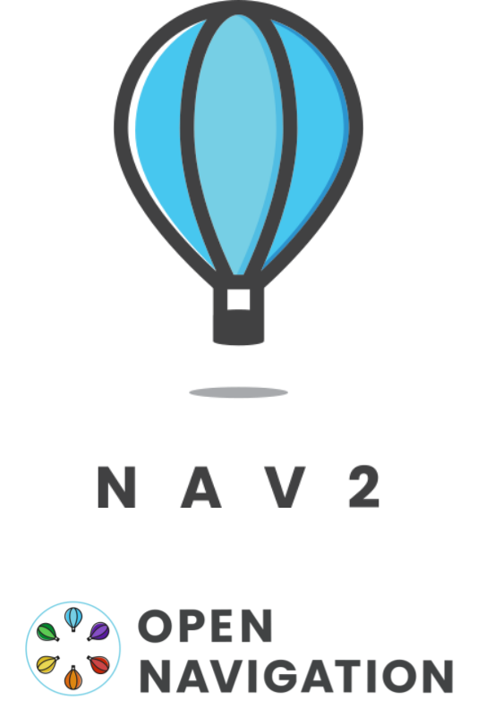
 
<b>ROS2 Navigation2</b>
 
<a href="https://github.com/ros-navigation/navigation2">Product Link</a>
</td>
</tr>
</table>

## MISSIONS

**Floorbot Challenge I Using Nav2 Goal Pose**

View the Mission: Rviz2 screencast of the path plan

https://www.youtube.com/watch?v=YAfdKwbhIpI

View the Video: iPhone piggyback ride on Stormy 

(between the battery and the emergency stop button) 

https://www.youtube.com/watch?v=Kj8ijCCRR4o

**Floorbot Challenge II Using Waypoints**

View the Mission: RViz2 screencast of the path plan

https://www.youtube.com/watch?v=tqyFS87C4XA

View the Video: RViz2 screencast of the path plan

https://www.youtube.com/watch?v=uny75an7diY

**DISCONTINUED PARTS**

**Low Voltage Disconnect (not in use)**

(https://www.amazon.com/dp/B019F3BEIO)

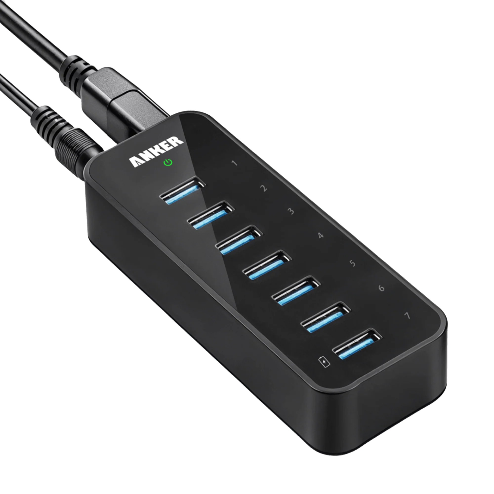

**Powered USB hub NOT IN USE - NOT UP TO THE TASK!**

to power Raspberry Pi and provide peripheral input to Pi (2 separate ports)

(https://www.amazon.com/dp/B014ZQ07NE)

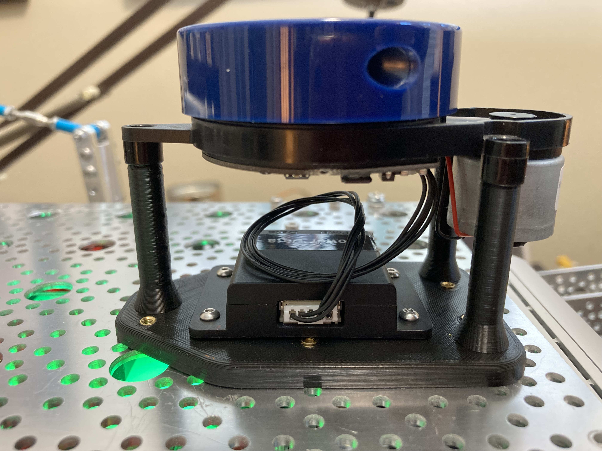

**YDLIDAR X2 drive belt deteriorated after years with no easy replacement.  See LD19 (or LD27 replacement)**

(https://www.amazon.com/dp/B07W613C1K)

**Buck voltage converter** Replaced by 52Pi power hat

(https://www.aliexpress.com/item/32881619997.html)

